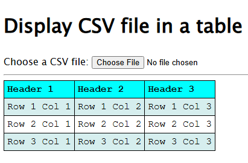

# Display CSV in a Table
Read and process any given local CSV file (without sending to server) and display it in an HTML table. No front-end framework was used in this project. I have used vanilla JavaScript and Papa Parse library. Papa Parse has no dependencies. I have directly manipulated DOM for deleting and inserting objects, to display variable rows and columns of the table, when a CSV file is loaded.

## Live Demo
You can view the live demo site on GitHub Pages at [https://farhanaliqureshi.github.io/csv-table](https://farhanaliqureshi.github.io/csv-table/)

## Demo Screenshots

## Why?
Once I needed to quickly view a CSV file in my mobile phone. However, it was difficult to look through the data in a simple text editor. That's when I came with this simple solution. No need to have cloud storage apps, internet connection, or any other heavy apps with full office suits.

## Install
Clone this repository. Make sure following files are in the same directory:
* `index.html`
* `script.js`
* `style.css`
* `papaparse.min.js`

## Usage
Open `index.html` in any modern browser. Click on the button "Choose File", and choose any local CSV file in your device. The CSV data will be displayed formatted in a table.

> [!IMPORTANT]
> This project expects the CSV file will have column headers.

## License
Copyright © [Farhan Ali Qureshi](https://github.com/FarhanAliQureshi). All rights reserved. This project is [MIT](LICENSE) licensed.
